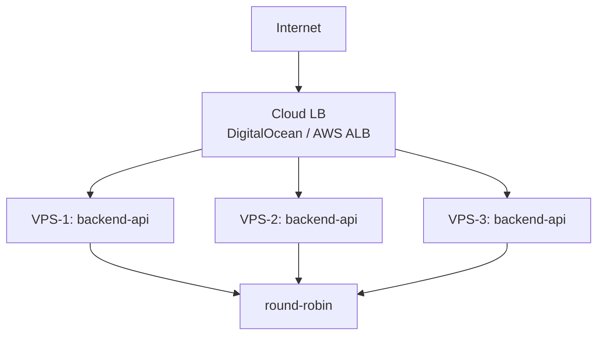
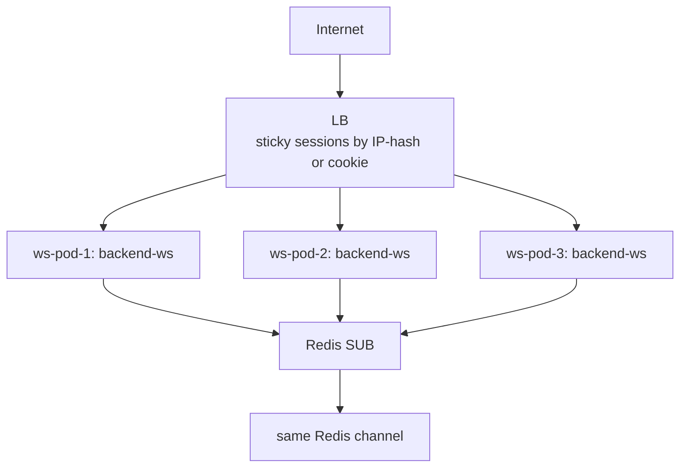

# ReadyBoard – Scalability Plan

## Current Architecture (Single VPS)

```
Internet → Nginx → backend-api (1 instance)
                 → backend-ws  (1 instance)
                 → frontend-admin
                 → frontend-display
            ↓
         PostgreSQL + Redis (single node)
```

A single VPS with 4 cores / 8GB RAM handles roughly **50,000 orders/day** comfortably.

---

## Step 1: Vertical Scaling (Quick Win)

Before adding nodes, squeeze more out of one machine:

| What | How |
|------|-----|
| **PostgreSQL connection pool** | Increase `MaxConns` in `db/postgres.go` up to `max_connections` - 5 |
| **Redis max connections** | Tune `maxmemory-policy allkeys-lru` in redis.conf |
| **Go GOMAXPROCS** | Set `GOMAXPROCS=N_CORES` in the service env. Consider using the uber-go/automaxprocs library to automatically set GOMAXPROCS based on the container's CPU quota, especially in Kubernetes where Go might see the host's CPU count instead of the allocated resources. |
| **nginx worker_processes** | Set to CPU count in nginx.conf |

---

## Step 2: Add a Load Balancer (Horizontal API Scaling)



**What changes:**
- Replace single `backend-api` with multiple instances behind the LB.
- The API is **stateless** (JWT + PostgreSQL) – no sticky sessions needed.
- Update `nginx.conf` upstream block to list all API instances.

```nginx
upstream backend_api {
    least_conn;
    server vps1:8080;
    server vps2:8080;
    server vps3:8080;
}
```

---

## Step 3: Scale WebSocket Service Horizontally

WebSocket scaling is inherently harder because connections are stateful (one client = one OS file descriptor on one machine). The Redis Pub/Sub bridge handles this:



**Each `backend-ws` pod**:
- Subscribes to `board:*` on Redis.
- Only broadcasts to its **locally** connected clients.
- No inter-pod communication needed (Redis fan-out handles it). While Redis Pub/Sub handles message distribution, using `ip_hash` for sticky sessions is recommended to reduce handshake overhead and maintain stability for long-lived WebSocket connections.

Configure nginx upstream with `ip_hash`:
```nginx
upstream backend_ws {
    ip_hash;   # sticky – keeps WS client on same pod
    server ws1:8081;
    server ws2:8081;
}
```

---

## Step 4: Managed Database + Redis (Production)

| Component | Single-VPS | Cluster Option |
|-----------|-----------|---------------|
| PostgreSQL | Docker container | AWS RDS / PlanetScale / Supabase |
| Redis | Docker container | AWS ElastiCache / Upstash |
| Backups | pg_dump cron | Managed automatic snapshots |

Switching requires only changing `DATABASE_URL` and `REDIS_URL` env vars – **no code changes**.

**Note:** These URLs must be managed via Environment Variables or Secret Managers (e.g., AWS Secrets Manager, HashiCorp Vault) to avoid hardcoding sensitive information.

---

## Step 5: Kubernetes (High Scale)

When >500k orders/day:

```yaml
# Example HPA for backend-ws
apiVersion: autoscaling/v2
kind: HorizontalPodAutoscaler
spec:
  scaleTargetRef:
    name: backend-ws
  minReplicas: 2
  maxReplicas: 20
  metrics:
    - type: Resource
      resource:
        name: cpu
        target:
          type: Utilization
          averageUtilization: 60
```

Use **Helm charts** for each service. Add an **Ingress controller** (nginx-ingress or Traefik) to replace the nginx-proxy container.

---

## Monitoring Checklist

- [ ] Prometheus + Grafana for Go metrics (`/metrics` endpoint via `promhttp`)
- [ ] pg_stat_activity alerts for slow queries
- [ ] Redis `INFO stats` → `keyspace_hits` / `keyspace_misses`
- [ ] Nginx access log → p99 latency via GoAccess or Loki
- [ ] Uptime monitor (Better Uptime / UptimeRobot) on `/health` endpoints
